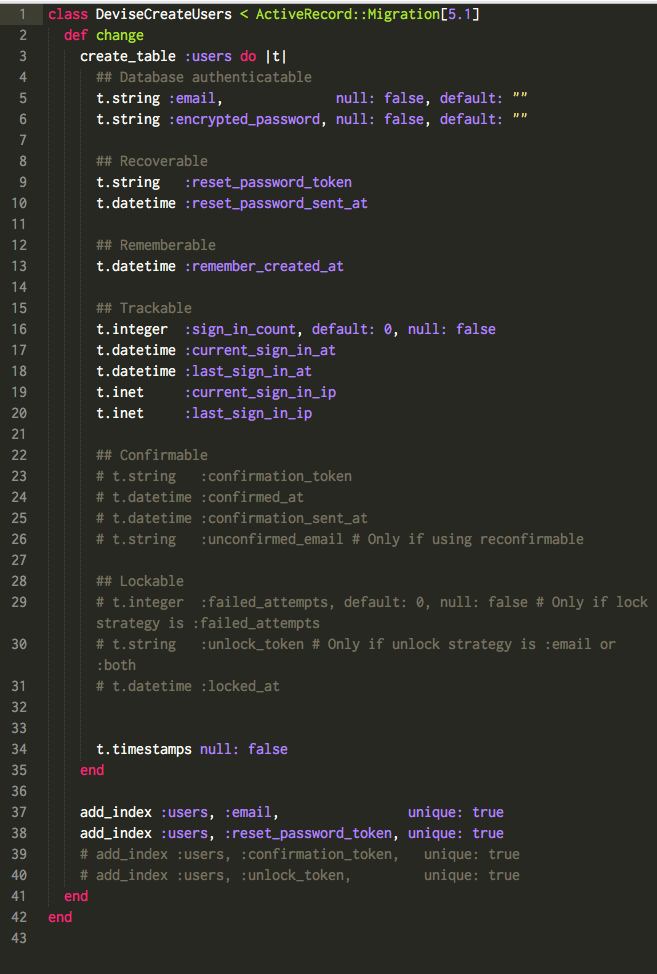

# Devise Overview

An authentication gem for Rails applications. Devise is built on top of Warden, a Rack-based middleware used in authentication. Warden manages cookie-handling for user verification and ultimately, is unconnected to the Rails application. Devise is the like the authentication bridge between the application and Warden - it provides the methods, views, helpers, etc. Like has_secure_password, the built in authentication in Rails, Devise uses BCrypt for password hashing.


# Installation
Add to Devise to your Gemfile: (installing in an existing application)
```gem 'devise'```
then run
```$ bundle install```

```$ rails g devise:install```

Once installed, Devise will offer some handy tips for manual setup:
```
Running via Spring preloader in process 47565
      create  config/initializers/devise.rb
      create  config/locales/devise.en.yml
===============================================================================

Some setup you must do manually if you haven't yet:

  1. Ensure you have defined default url options in your environments files. Here
     is an example of default_url_options appropriate for a development environment
     in config/environments/development.rb:

       config.action_mailer.default_url_options = { host: 'localhost', port: 3000 }

     In production, :host should be set to the actual host of your application.

  2. Ensure you have defined root_url to *something* in your config/routes.rb.
     For example:

       root to: "home#index"

  3. Ensure you have flash messages in app/views/layouts/application.html.erb.
     For example:

       <p class="notice"><%= notice %></p>
       <p class="alert"><%= alert %></p>

  4. You can copy Devise views (for customization) to your app by running:

       rails g devise:views
```

## Setup

1. Go into config > environments > development.rb to add the following:

> config.action_mailer.default_url_options = { host: 'localhost', port: 3000 }

If you plan to launch your blog and you're adding it to production, the host:
should be set to the application host, not localhost.

2. Ensure the root is defined in your routes.rb file, for example:

> root "posts#index"

3. Flash messages. Important.

4. Add a views folder for devise. I recommend just going ahead with
```$ rails g devise:views```
because it creates about 18 files that would take at least 18 hours to type.

**Files created:**


## To set up a user
```$ rails g devise User```
This creates a user migration and model, a test suite for the user, and a route in
routes.rb called `devise_for :users`.

**Migration (default):**



**Routes created:**


_With that new migration file, you'll need to re-migrate._

**Afterwards, run your rails server and check the routes:**


**Here's the code that was generated:**


**Sign up page:**


## Devise vs. has_secure_password
### Refresh on has_secure_password
```has_secure_password``` is very customizable and built right into rails, so maintaining a gem isn't an issue. However, as an application grows, more and more features often need to be added and these features are opportunities for vulnerabilities.


Reviews on Devise are pretty mixed - some people seem to hate it and some love it. Overall, using Devise or `has_secure_password ` is really up to you and the scale of your project.

| Pros | Cons |
| ----- | ----- |
| Built in methods and helpers like:| Too Helpful?
 before_action :authenticate_user!|
 current_user|
 user_signed_in?|
 sign_in(@user)|
 user_session |
 | Customizable:  | Too Customizable? |
| routes|
 views level |
 controller level |
| lots of documentation available | learning curve to fully comprehending the docs |
| well-supported and adopted in the field | additional dependency in your app |
| OmniAuth integration | OmniAuth integration |

*** in order to customize at the controller level, use
``` $ rails generate devise:contorollers [users] ```

# Resources
* Wiki: [https://github.com/plataformatec/devise/wiki]
- Getting Started: [https://github.com/plataformatec/devise#getting-started]
* SitePoint Tutorial: [https://www.sitepoint.com/devise-authentication-in-depth/]
* GoRails Tutorial: [https://gorails.com/episodes/user-authentication-with-devise]

